# Pyunix 2.0 — Proposta de Arquitetura da Engine

> **Documento de Arquitetura Técnica**
> Nestifypy · Pyunix Game Engine · Versão de referência

---

## Sumário

1. [Diagnóstico: Onde o Pygame Vaza Hoje](#1-diagnóstico)
2. [Visão Geral da Nova Arquitetura](#2-visão-geral)
3. [Camada de Abstração Gráfica — `Draw` e `Canvas`](#3-draw-e-canvas)
4. [Sistema de Shapes](#4-shapes)
5. [Sistema de UI Declarativa](#5-ui)
6. [Sistema de Fontes e Texto](#6-fontes)
7. [Assets 2.0](#7-assets)
8. [Sistema de Componentes (Component-Based Architecture)](#8-componentes)
9. [Sistema ECS Opcional](#9-ecs)
10. [Cenas 2.0](#10-cenas)
11. [Partículas 2.0](#11-partículas)
12. [Animação 2.0](#12-animação)
13. [Tilemap 2.0](#13-tilemap)
14. [Pathfinding e IA](#14-pathfinding-ia)
15. [Ferramentas de Desenvolvimento](#15-devtools)
16. [Reorganização de Pacotes](#16-pacotes)
17. [Roadmap por Fases](#17-roadmap)
18. [Exemplos Reais da Nova API](#18-exemplos)

---

## 1. Diagnóstico

### 1.1 Pontos de Vazamento do Pygame

Abaixo estão todos os lugares no código atual onde o usuário **precisa** ou é **incentivado** a usar Pygame diretamente:

#### `app.py` — Loop Principal
```python
# VAZAMENTO: screen.fill() recebe uma Surface do Pygame
@Game.draw
def on_draw(self, screen):
    screen.fill((30, 30, 40))   # usuário manipula Surface diretamente
    screen.blit(self.bg, (0,0)) # Surface.blit exposta
```

#### `sprite.py` — Entidades
```python
# VAZAMENTO: entity.image = pygame.Surface
# VAZAMENTO: draw_self recebe surface do pygame
self.image = pygame.Surface((32,32))  # nunca deveria aparecer no jogo
```

#### `text.py` — Texto
```python
# VAZAMENTO: font = pygame.font.SysFont(...)
# VAZAMENTO: Canvas recebe pygame.Surface
font = pygame.font.SysFont(None, 32)
texto = font.render("Pontos", True, (255,255,255))
screen.blit(texto, (10, 10))
```

#### Renderização Manual de Shapes
```python
# VAZAMENTO: pygame.draw.* exposto ao desenvolvedor
import pygame
pygame.draw.rect(surface, (255, 0, 0), rect)
pygame.draw.circle(surface, color, center, radius)
```

#### Documentação (`pyunix.md`) — Exemplo Completo
```python
# Linha 1603 — draw_ui usa pygame diretamente:
@Game.layer("ui", order=1)
def desenhar_ui(self, screen):
    import pygame
    font = pygame.font.SysFont(None, 32)
    texto = font.render(f"Pontos: {self.pontos}", True, (255, 255, 100))
    screen.blit(texto, (10, 10))

# Linhas 1520-1544 — Jogador e Plataforma usam pygame.draw.rect
@Sprite.draw
def renderizar(self, surface):
    import pygame
    rect = pygame.Rect(self.x - 14, self.y - 24, 28, 48)
    pygame.draw.rect(surface, (100, 180, 255), rect)
```

#### `camera.py` — Parallax
```python
# VAZAMENTO: surface.blit() interno, mas exposto indiretamente
surface.blit(lsurf, (x, y))  # interno mas revela Surface no draw_parallax
```

#### `audio.py` — Pitch Variance
```python
# VAZAMENTO: numpy + pygame.sndarray exposto internamente
arr = pygame.sndarray.array(snd)
```

#### `particles.py` — Draw
```python
# VAZAMENTO: pygame.Surface e pygame.draw.circle expostos no draw()
def draw(self, surface: Any, offset: ...):
    pygame.draw.circle(surface, ...)  # chamado pelo usuário com a surface
```

#### `tilemap.py` — Draw
```python
surface.blit(tile_surf, (dx, dy))  # usuário passa surface do pygame
```

### 1.2 Problema Raiz

O problema não é apenas cosmético. Existem **três camadas de vazamento**:

| Tipo | Exemplo | Impacto |
|---|---|---|
| **Tipo Pygame exposto** | `pygame.Surface`, `pygame.Rect` | Usuário precisa conhecer Pygame |
| **Paradigma Pygame exposto** | `surface.blit(img, pos)` | API imperativa de baixo nível |
| **Semântica Pygame exposta** | `screen.fill((r,g,b))` | Sem abstração semântica |

A solução não é apenas renomear — é **reconstruir a camada de saída** com tipos e paradigmas próprios.

---

## 2. Visão Geral da Nova Arquitetura



```
┌─────────────────────────────────────────────────────────────┐
│                    DESENVOLVEDOR DO JOGO                     │
│          from nestifypy.pyunix import *                      │
│                                                              │
│  Game · Entity · Sprite · Scene · Input · Camera · Audio    │
│  Draw · Canvas · UI · Assets · Physics · Tween · Timer      │
│  Text · Shape · Particles · Tilemap · Animator · Component  │
└──────────────────────────┬──────────────────────────────────┘
                           │  API pública (sem pygame)
┌──────────────────────────▼──────────────────────────────────┐
│                  PYUNIX ENGINE LAYER                         │
│                                                              │
│  ┌──────────┐  ┌──────────┐  ┌──────────┐  ┌────────────┐  │
│  │  Runtime │  │ Renderer │  │ UI System│  │  ECS World │  │
│  │ (app.py) │  │(canvas.py│  │ (ui.py)  │  │ (world.py) │  │
│  └──────────┘  └──────────┘  └──────────┘  └────────────┘  │
│                                                              │
│  ┌──────────┐  ┌──────────┐  ┌──────────┐  ┌────────────┐  │
│  │ Physics  │  │ Assets   │  │  Scene   │  │  DevTools  │  │
│  │(physics) │  │(assets)  │  │(scene.py)│  │(devtools/) │  │
│  └──────────┘  └──────────┘  └──────────┘  └────────────┘  │
└──────────────────────────┬──────────────────────────────────┘
                           │  Backend (oculto do dev)
┌──────────────────────────▼──────────────────────────────────┐
│                  PYGAME BACKEND (PRIVADO)                    │
│                                                              │
│   pygame.display · pygame.draw · pygame.Surface             │
│   pygame.font · pygame.mixer · pygame.event                 │
│   pygame.transform · pygame.image                           │
└─────────────────────────────────────────────────────────────┘
```

### Princípio Fundamental

> O Pygame é um **detalhe de implementação**, não uma dependência do usuário.
> Assim como um desenvolvedor React não manipula o DOM diretamente, um desenvolvedor
> Pyunix não deve nunca tocar em `pygame.Surface` ou `pygame.draw`.

---

## 3. Draw e Canvas

### 3.1 `Draw` — API de Desenho de Shapes

Substitui todas as chamadas `pygame.draw.*`:

```python
# nestifypy/pyunix/draw.py

class DrawAPI:
    """
    API de desenho primitivo — shapes, linhas, imagens.
    Toda renderização deve passar por aqui, nunca por pygame.draw diretamente.
    """

    # ── Shapes ───────────────────────────────────────────────

    def rect(
        self,
        x: float, y: float,
        width: float, height: float,
        color: Color | str,
        *,
        filled: bool = True,
        border_radius: int = 0,
        stroke_width: int = 1,
        alpha: int = 255,
    ) -> None: ...

    def circle(
        self,
        x: float, y: float,
        radius: float,
        color: Color | str,
        *,
        filled: bool = True,
        stroke_width: int = 1,
    ) -> None: ...

    def ellipse(
        self,
        x: float, y: float,
        width: float, height: float,
        color: Color | str,
        *,
        filled: bool = True,
    ) -> None: ...

    def line(
        self,
        x1: float, y1: float,
        x2: float, y2: float,
        color: Color | str,
        width: int = 1,
    ) -> None: ...

    def lines(
        self,
        points: list[tuple[float, float]],
        color: Color | str,
        *,
        closed: bool = False,
        width: int = 1,
    ) -> None: ...

    def polygon(
        self,
        points: list[tuple[float, float]],
        color: Color | str,
        *,
        filled: bool = True,
        stroke_width: int = 1,
    ) -> None: ...

    def arc(
        self,
        x: float, y: float,
        width: float, height: float,
        start_angle: float, stop_angle: float,
        color: Color | str,
        stroke_width: int = 1,
    ) -> None: ...

    # ── Imagens ──────────────────────────────────────────────

    def image(
        self,
        asset_path: str,
        x: float, y: float,
        *,
        scale: tuple[int, int] = None,
        rotation: float = 0.0,
        alpha: int = 255,
        flip_x: bool = False,
        flip_y: bool = False,
        anchor: str = "topleft",
    ) -> None: ...

    def image_surface(
        self,
        surface: "Surface",   # tipo interno do pyunix, não pygame.Surface
        x: float, y: float,
        *,
        rotation: float = 0.0,
        alpha: int = 255,
    ) -> None: ...

    # ── Texto inline ─────────────────────────────────────────

    def text(
        self,
        text: str,
        x: float, y: float,
        *,
        font: str = "default",
        size: int = 24,
        color: Color | str = "white",
        anchor: str = "topleft",
    ) -> None: ...


Draw = DrawAPI()
```

### 3.2 `Canvas` — Superfície de Renderização

Substitui a `pygame.Surface` exposta via `screen`:

```python
# nestifypy/pyunix/canvas.py

class Canvas:
    """
    Superfície de renderização de alto nível.
    Esconde completamente a pygame.Surface do desenvolvedor.
    """

    def clear(self, color: Color | str = "black") -> None:
        """Limpa o canvas com uma cor. Substitui screen.fill()."""
        ...

    def fill(self, color: Color | str) -> None:
        """Alias para clear()."""
        ...

    def draw_rect(self, ...) -> None: ...    # delega para Draw
    def draw_circle(self, ...) -> None: ...
    def draw_image(self, ...) -> None: ...

    def snapshot(self, path: str = "screenshot.png") -> None:
        """Salva o frame atual em disco."""
        ...

    @property
    def width(self) -> int: ...

    @property
    def height(self) -> int: ...

    @property
    def size(self) -> tuple[int, int]: ...

    @property
    def center(self) -> tuple[int, int]: ...


# Singleton global
Canvas = CanvasSystem()
```

### 3.3 Mudanças no Game Loop

**Antes (vazamento):**
```python
@Game.draw
def on_draw(self, screen):         # screen é uma pygame.Surface
    screen.fill((30, 30, 40))
    screen.blit(self.bg, (0, 0))
```

**Depois (pyunix puro):**
```python
@Game.draw
def on_draw(self):                 # sem parâmetro! canvas é global
    Canvas.clear(Color.from_hex("#1e1e28"))
    Draw.image("bg.png", 0, 0)
```

Ou usando layers:

```python
@Game.layer("mundo", order=0)
def desenhar_mundo(self):
    Canvas.clear("#1e1e28")
    self.tilemap.draw()            # tilemap cuida do próprio draw

@Game.layer("ui", order=1)
def desenhar_ui(self):
    Draw.text(f"Pontos: {self.pontos}", 10, 10, color="yellow", size=24)
```

---

## 4. Shapes

### 4.1 Objetos de Shape como Entidades

Além da API `Draw.*` (imperativa), Shapes podem ser instâncias com ciclo de vida:

```python
# nestifypy/pyunix/shapes.py

class Rectangle(Entity):
    def __init__(
        self,
        x, y, width, height,
        color: Color | str = "white",
        *,
        filled: bool = True,
        border_radius: int = 0,
        stroke_width: int = 1,
        layer: str = "default",
    ): ...

class Circle(Entity):
    def __init__(self, x, y, radius, color, *, filled=True): ...

class Line(Entity):
    def __init__(self, x1, y1, x2, y2, color, width=1): ...

class Polygon(Entity):
    def __init__(self, points, color, *, filled=True): ...

class Capsule(Entity):
    def __init__(self, x, y, width, height, color): ...

class Triangle(Entity):
    def __init__(self, x1,y1, x2,y2, x3,y3, color, *, filled=True): ...
```

**Uso:**
```python
# Imperativo (frame a frame)
Draw.rect(100, 200, 50, 50, Color.RED)

# Declarativo (entidade persistente com ciclo de vida)
plataforma = Rectangle(400, 420, 800, 40, color="#508050")
plataforma.collider = BoxCollider(800, 40)
```

---

## 5. UI

### 5.1 Sistema de UI Completo

O maior gap atual. A UI deve ser completamente declarativa e independente do Pygame.

```python
# nestifypy/pyunix/ui/__init__.py

# Componentes de layout
from .layout import Column, Row, Stack, Grid, Spacer, Padding
# Componentes visuais
from .components import (
    Label, Button, Panel, Image,
    ProgressBar, Slider, InputField,
    CheckBox, RadioButton, Toggle,
    Dropdown, ScrollView, Tooltip,
    Badge, Separator, Icon,
)
# Sistema declarativo
from .view import UIView, UI
```

### 5.2 Componentes Base

```python
class Label:
    def __init__(
        self,
        text: str | Callable[[], str],
        *,
        x: float = 0, y: float = 0,
        font: str = "default",
        size: int = 20,
        color: Color | str = "white",
        align: str = "left",
        shadow: bool = False,
        outline: bool = False,
        max_width: int = None,
        layer: str = "ui",
    ): ...
    
    # Suporta binding reativo
    # Se text é callable, é avaliado toda frame automaticamente
    # Label(lambda: f"FPS: {Game.fps}")


class Button:
    def __init__(
        self,
        text: str,
        *,
        x: float = 0, y: float = 0,
        width: int = 120, height: int = 40,
        color: Color | str = "#3060A0",
        text_color: Color | str = "white",
        hover_color: Color | str = "#4080C0",
        border_radius: int = 6,
        on_click: Callable = None,
        on_hover: Callable = None,
        disabled: bool = False,
        icon: str = None,
    ): ...


class ProgressBar:
    def __init__(
        self,
        value: float = 0.0,      # 0.0 – 1.0
        *,
        x: float = 0, y: float = 0,
        width: int = 200, height: int = 20,
        fg_color: Color | str = "#40A060",
        bg_color: Color | str = "#303030",
        border_radius: int = 4,
        show_label: bool = False,
        label_format: str = "{:.0%}",
    ): ...


class InputField:
    def __init__(
        self,
        placeholder: str = "",
        *,
        x: float = 0, y: float = 0,
        width: int = 200, height: int = 36,
        font_size: int = 18,
        color: Color | str = "white",
        bg_color: Color | str = "#1a1a2e",
        border_color: Color | str = "#5050A0",
        on_submit: Callable[[str], None] = None,
        on_change: Callable[[str], None] = None,
        max_length: int = None,
        password: bool = False,
    ): ...
    
    @property
    def value(self) -> str: ...


class Dropdown:
    def __init__(
        self,
        options: list[str],
        *,
        x: float = 0, y: float = 0,
        width: int = 160, height: int = 36,
        selected: int = 0,
        on_change: Callable[[str, int], None] = None,
    ): ...

    @property
    def selected_value(self) -> str: ...


class ScrollView:
    def __init__(
        self,
        *,
        x: float = 0, y: float = 0,
        width: int = 300, height: int = 200,
        content_height: int = None,
    ): ...
    
    def add(self, *elements) -> "ScrollView": ...
```

### 5.3 UI Declarativa — `UIView`

Inspirada em Flutter/SwiftUI:

```python
class UIView:
    """
    Classe base para views declarativas de UI.
    Recria a UI quando o estado muda (dirty flag).
    """
    
    def rebuild(self) -> "UIElement":
        """Override para definir a estrutura da UI."""
        raise NotImplementedError


@Scene("menu")
class MenuScene(UIView):

    def __init__(self):
        self.musica_ativa = True

    @Scene.load
    def on_load(self):
        pass

    @UI.build          # decorator que chama rebuild() automaticamente
    def render(self):
        return Column(
            gap=20,
            align="center",
            children=[
                Label("Meu Jogo", size=48, color="#FFD700", shadow=True),
                Label("v1.0.0", size=16, color="#888888"),
                Spacer(height=20),
                Button("Jogar",     width=200, on_click=self._jogar),
                Button("Opções",    width=200, on_click=self._opcoes),
                Button("Sair",      width=200, on_click=self._sair,
                       color="#803030"),
                Separator(),
                Row(
                    gap=8,
                    children=[
                        Toggle(self.musica_ativa, on_change=self._toggle_musica),
                        Label("Música", size=16),
                    ]
                ),
            ]
        )

    def _jogar(self):
        Scene.switch("jogo")

    def _opcoes(self):
        Scene.push("opcoes")

    def _sair(self):
        Game.quit()

    def _toggle_musica(self, ativo: bool):
        self.musica_ativa = ativo
        Audio.set_music_volume(1.0 if ativo else 0.0)
```

### 5.4 Layout Containers

```python
class Column:
    """Empilha filhos verticalmente."""
    def __init__(
        self,
        children: list,
        *,
        x: float = 0, y: float = 0,
        gap: int = 8,
        align: str = "left",   # "left" | "center" | "right"
        padding: int | tuple = 0,
    ): ...


class Row:
    """Alinha filhos horizontalmente."""
    def __init__(
        self,
        children: list,
        *,
        x: float = 0, y: float = 0,
        gap: int = 8,
        align: str = "top",    # "top" | "center" | "bottom"
    ): ...


class Stack:
    """Sobrepõe filhos (posição absoluta relativa ao container)."""
    def __init__(
        self,
        children: list,
        *,
        x: float = 0, y: float = 0,
        width: int = 0, height: int = 0,
    ): ...


class Panel:
    """Container visual com fundo, borda e padding."""
    def __init__(
        self,
        children: list = None,
        *,
        x: float = 0, y: float = 0,
        width: int = 300, height: int = 200,
        color: Color | str = "#1a1a2e",
        border_color: Color | str = None,
        border_width: int = 0,
        border_radius: int = 8,
        padding: int = 16,
    ): ...


class Anchor:
    """Ancora um filho em um canto/borda da tela."""
    TOP_LEFT     = "top_left"
    TOP_RIGHT    = "top_right"
    BOTTOM_LEFT  = "bottom_left"
    BOTTOM_RIGHT = "bottom_right"
    CENTER       = "center"
    TOP_CENTER   = "top_center"


class AnchoredPanel:
    def __init__(self, child, anchor: str, margin: int = 16): ...
```

---

## 6. Fontes e Texto

### 6.1 `FontSystem` Melhorado

```python
# nestifypy/pyunix/fonts.py

class FontSystem:
    
    def load(self, name: str, path: str) -> None: ...
    
    def load_from_url(self, name: str, url: str) -> None:
        """Baixa e carrega uma fonte por URL (ex: Google Fonts)."""
        ...

    def get(self, name: str, size: int, bold=False, italic=False) -> "_Font": ...
    
    def set_default(self, name: str) -> None:
        """Define a fonte padrão global."""
        ...
    
    def measure(self, text: str, name: str, size: int) -> tuple[int, int]:
        """Retorna (largura, altura) do texto sem renderizar."""
        ...


Fonts = FontSystem()
```

### 6.2 `Text` Entity Melhorada

```python
# nestifypy/pyunix/text.py

class Text(Entity):
    """
    Entidade de texto rica — sem expor pygame.font em nenhum momento.
    Suporta binding reativo via callable.
    """
    def __init__(
        self,
        text: str | Callable[[], str] = "",
        x: float = 0.0,
        y: float = 0.0,
        *,
        font: str = "default",
        size: int = 24,
        color: Color | str = "white",
        bold: bool = False,
        italic: bool = False,
        shadow: bool = False,
        shadow_color: Color | str = "black",
        shadow_offset: tuple[int, int] = (2, 2),
        outline: bool = False,
        outline_color: Color | str = "black",
        outline_size: int = 1,
        align: str = "left",
        anchor: str = "topleft",
        layer: str = "ui",
        max_width: int = None,
        line_spacing: float = 1.2,
        # NOVO: binding reativo
        bind: Callable[[], str] = None,
    ): ...

    # NOVO: binding
    def bind(self, fn: Callable[[], str]) -> "Text":
        """Liga o texto a uma função chamada automaticamente todo frame."""
        ...

    # NOVO: RichText
    @classmethod
    def rich(cls, markup: str, ...) -> "Text":
        """
        Markup simples: [color=#FF0][b]negrito[/b][/color]
        Inspirado no BBCode do Godot.
        """
        ...
```

**Uso novo sem pygame:**
```python
# Antes (RUIM - vazamento):
font = pygame.font.SysFont(None, 32)
texto = font.render("Pontos", True, (255,255,255))
screen.blit(texto, (10, 10))

# Depois (CORRETO - pyunix puro):
# Opção 1: Draw inline
Draw.text("Pontos: 100", 10, 10, size=32, color="white")

# Opção 2: Entidade com binding reativo
score_label = Text(lambda: f"Pontos: {self.pontos}", 10, 10, size=32, color="yellow")

# Opção 3: Rich text
hp_text = Text.rich("[color=#FF5050][b]HP:[/b][/color] 80/100", 10, 40, size=20)
```

---

## 7. Assets 2.0

### 7.1 API Expandida

```python
# nestifypy/pyunix/assets.py

class AssetManager:

    # ── Existentes (melhorados) ──────────────────────
    
    def image(self, path: str, **opts) -> "Surface": ...    # Surface próprio, não pygame
    def sound(self, path: str) -> "Sound": ...
    def font(self, name: str, size: int) -> "Font": ...
    def spritesheet(self, ...) -> list["Surface"]: ...

    # ── Novos ───────────────────────────────────────

    def music(self, path: str) -> "MusicTrack":
        """Retorna handle de música (para controle posterior)."""
        ...

    def animation(self, path: str) -> "AnimationClip":
        """Carrega um arquivo .anim ou JSON de animação."""
        ...

    def tilemap(self, path: str) -> "TileMap":
        """Carrega um arquivo .tmx (Tiled) ou JSON de tilemap."""
        ...

    def shader(self, vert_path: str, frag_path: str) -> "Shader":
        """Carrega um shader GLSL (requer backend OpenGL)."""
        ...

    def nine_slice(
        self,
        path: str,
        left: int, right: int, top: int, bottom: int,
    ) -> "NineSlice":
        """
        Carrega imagem como 9-slice (painel escalável sem distorção).
        Essencial para UI com cantos arredondados.
        """
        ...

    def atlas(self, json_path: str) -> "SpriteAtlas":
        """Carrega um atlas gerado por TexturePacker ou Aseprite."""
        ...

    def aseprite(self, path: str) -> "AsepriteFile":
        """
        Carrega arquivo .aseprite diretamente.
        Extrai frames, tags de animação e slices.
        """
        ...

    # ── Cache e Loading ──────────────────────────────

    async def preload_async(self, *paths: str) -> None:
        """Pré-carrega assets de forma assíncrona (para loading screens)."""
        ...

    def preload_scene(self, scene_name: str) -> None:
        """Pré-carrega todos os assets declarados em @Assets.for_scene(name)."""
        ...

    def unload_scene(self, scene_name: str) -> None:
        """Libera assets de uma cena que não está mais em uso."""
        ...

    @contextmanager
    def loading_screen(self, callback: Callable[[float], None]):
        """
        Context manager para loading screens com progresso:
        
        with Assets.loading_screen(lambda p: hud.update_progress(p)):
            Assets.image("hero.png")
            Assets.sound("bgm.mp3")
        """
        ...


Assets = AssetManager()
```

### 7.2 `Surface` — Tipo Próprio

```python
# nestifypy/pyunix/_surface.py
# NUNCA exportado diretamente ao dev, apenas internamente

class Surface:
    """
    Wrapper sobre pygame.Surface.
    Nunca exposto diretamente — apenas métodos semânticos.
    """
    
    def __init__(self, width: int, height: int, alpha: bool = True): ...
    
    @classmethod
    def from_pygame(cls, pygame_surface) -> "Surface": ...
    
    # Métodos semânticos (não expõem pygame)
    def tint(self, color: Color) -> "Surface": ...
    def outline(self, color: Color, thickness: int = 1) -> "Surface": ...
    def scale(self, new_size: tuple[int, int]) -> "Surface": ...
    def flip(self, x: bool = False, y: bool = False) -> "Surface": ...
    def rotate(self, degrees: float) -> "Surface": ...
    def crop(self, rect: "Rect") -> "Surface": ...

    @property
    def width(self) -> int: ...
    
    @property
    def height(self) -> int: ...
    
    @property
    def size(self) -> tuple[int, int]: ...
```

---

## 8. Componentes

### 8.1 Sistema de Componentes Estilo Unity

```python
# nestifypy/pyunix/component.py

class Component:
    """
    Classe base para todos os componentes customizados.
    
    Componentes adicionam comportamento a Entities
    sem herança. Inspirado no Unity MonoBehaviour.
    """
    
    @property
    def entity(self) -> "Entity":
        """Referência de volta para a entidade dona."""
        return self._entity

    # Hooks opcionais (sobrescreva os que precisar)
    def on_attach(self) -> None:
        """Chamado quando o componente é adicionado à entidade."""
        ...

    def on_detach(self) -> None:
        """Chamado quando o componente é removido."""
        ...

    def on_update(self, dt: float) -> None:
        """Chamado todo frame."""
        ...

    def on_fixed_update(self) -> None:
        """Chamado na taxa fixa de física."""
        ...

    def on_draw(self) -> None:
        """Chamado no frame de renderização."""
        ...

    def on_collision_enter(self, info: "CollisionInfo") -> None: ...
    def on_collision_exit(self, info: "CollisionInfo") -> None: ...
    def on_destroy(self) -> None: ...
    def on_pause(self) -> None: ...
    def on_resume(self) -> None: ...
```

### 8.2 Usando Componentes

```python
# Componente de Saúde
class Health(Component):
    def __init__(self, max_hp: int = 100):
        self.max_hp = max_hp
        self.hp = max_hp
        self._invincible_timer = 0.0

    def on_update(self, dt: float):
        if self._invincible_timer > 0:
            self._invincible_timer -= dt

    def take_damage(self, amount: int) -> bool:
        if self._invincible_timer > 0:
            return False
        self.hp = max(0, self.hp - amount)
        self._invincible_timer = 0.5
        Event.emit("damage_taken", {"entity": self.entity, "amount": amount})
        if self.hp <= 0:
            Event.emit("entity_died", self.entity)
        return True

    @property
    def is_alive(self) -> bool:
        return self.hp > 0

    @property
    def ratio(self) -> float:
        return self.hp / self.max_hp


# Componente de Drop de Item
class ItemDrop(Component):
    def __init__(self, items: list[str], chance: float = 0.5):
        self._items = items
        self._chance = chance

    def on_destroy(self):
        if random.random() < self._chance:
            item = random.choice(self._items)
            Event.emit("item_dropped", {"item": item, "pos": self.entity.position})


# Usando
class Inimigo(Entity):
    def __init__(self, x, y):
        super().__init__(x=x, y=y)
        
        # Adiciona componentes como no Unity
        self.add_component(Health(max_hp=50))
        self.add_component(ItemDrop(["moeda", "pocao"], chance=0.3))
        
        # Visual
        self.image = Assets.image("enemy.png")

    @Sprite.update
    def update(self, dt):
        health = self.get_component(Health)
        if not health.is_alive:
            self.destroy()

    @Sprite.on_collision_enter
    def on_hit(self, info):
        if info.other.tag == "bullet":
            self.get_component(Health).take_damage(10)
```

### 8.3 Componentes Built-in Novos

```python
# Componentes prontos que acompanham o engine:

class FlashOnHit(Component):
    """Pisca a entidade em branco ao receber dano."""
    def __init__(self, duration: float = 0.1, color: Color = Color.WHITE): ...

class Billboard(Component):
    """Faz a entidade sempre olhar para a câmera."""
    ...

class ScreenWrap(Component):
    """Teletransporta a entidade para o outro lado da tela ao sair."""
    ...

class Floater(Component):
    """Faz a entidade flutuar para cima e para baixo suavemente."""
    def __init__(self, amplitude: float = 8, speed: float = 2.0): ...

class AutoDestroy(Component):
    """Destroi a entidade após N segundos."""
    def __init__(self, after: float): ...

class FollowTarget(Component):
    """Faz a entidade seguir um alvo com velocidade configurável."""
    def __init__(self, target: "Entity", speed: float, min_distance: float = 0): ...

class Interactable(Component):
    """Marca a entidade como interagível (E para interagir)."""
    def __init__(self, prompt: str = "Interagir", on_interact: Callable = None): ...

class Spawner(Component):
    """Spawna entidades em intervalos."""
    def __init__(
        self,
        factory: Callable[[], "Entity"],
        interval: float,
        max_alive: int = 10,
    ): ...
```

---

## 9. ECS Opcional

Para jogos maiores, com milhares de entidades:

```python
# nestifypy/pyunix/ecs/__init__.py

class World:
    """
    ECS World — opcional para jogos com alta densidade de entidades.
    Use quando performance importar mais que ergonomia OO.
    """

    def create_entity(self) -> int:
        """Retorna um ID de entidade."""
        ...

    def add_component(self, entity_id: int, component: Any) -> None: ...
    def get_component(self, entity_id: int, component_type: type) -> Any: ...
    def remove_component(self, entity_id: int, component_type: type) -> None: ...
    def destroy_entity(self, entity_id: int) -> None: ...

    def query(self, *component_types: type) -> Iterable[tuple[int, ...]]:
        """
        Retorna todos os (entity_id, comp1, comp2...) que tenham
        todos os componentes listados. Muito eficiente.
        """
        ...

    def add_system(self, system: "System") -> None: ...
    def update(self, dt: float) -> None: ...


class System:
    """Base para sistemas ECS."""
    
    def update(self, world: "World", dt: float) -> None:
        raise NotImplementedError


# Exemplo de uso:
class MovementSystem(System):
    def update(self, world: World, dt: float) -> None:
        for entity_id, pos, vel in world.query(Position, Velocity):
            pos.x += vel.x * dt
            pos.y += vel.y * dt


class RenderSystem(System):
    def update(self, world: World, dt: float) -> None:
        for entity_id, pos, sprite in world.query(Position, Sprite):
            Draw.image_surface(sprite.surface, pos.x, pos.y)


# Componentes ECS (plain dataclasses — sem herança obrigatória)
from dataclasses import dataclass

@dataclass
class Position:
    x: float = 0.0
    y: float = 0.0

@dataclass
class Velocity:
    x: float = 0.0
    y: float = 0.0

@dataclass
class SpriteComponent:
    path: str
    surface: "Surface" = None
```

---

## 10. Cenas 2.0

### 10.1 API Expandida

```python
# nestifypy/pyunix/scene.py

class SceneAPI:

    # ── Registro ─────────────────────────────────
    
    def __call__(self, name: str) -> Callable:
        """@Scene("menu") — registra a classe como cena."""
        ...

    # ── Stack ────────────────────────────────────

    def push(self, name: str, data: Any = None) -> None: ...
    def pop(self, data: Any = None) -> None: ...
    def switch(self, name: str, data: Any = None) -> None: ...

    # NOVO: transições com efeitos visuais
    def switch_with_transition(
        self,
        name: str,
        transition: "Transition",
        data: Any = None,
    ) -> None: ...

    # ── Preload ──────────────────────────────────

    def preload(self, name: str) -> None:
        """Carrega a cena em background sem ativá-la."""
        ...

    # ── Persistência ─────────────────────────────

    def get_persistent(self, key: str, default: Any = None) -> Any:
        """Lê dado persistente entre cenas."""
        ...

    def set_persistent(self, key: str, value: Any) -> None:
        """Escreve dado persistente entre cenas."""
        ...

    # ── Transições built-in ───────────────────────

    @staticmethod
    def fade(duration: float = 0.5, color: Color = Color.BLACK) -> "FadeTransition": ...

    @staticmethod
    def slide(direction: str = "left", duration: float = 0.4) -> "SlideTransition": ...

    @staticmethod
    def zoom(duration: float = 0.5) -> "ZoomTransition": ...

    @staticmethod
    def loading_screen(
        loader: Callable,
        background: Color | str = "black",
    ) -> "LoadingTransition":
        """
        Exibe loading screen enquanto carrega assets da próxima cena.
        
        Scene.switch_with_transition(
            "jogo",
            Scene.loading_screen(lambda: Assets.preload("world.png", "music.mp3"))
        )
        """
        ...
```

### 10.2 Uso com Transições

```python
# Fade
Scene.switch_with_transition("jogo", Scene.fade(duration=0.8, color=Color.BLACK))

# Loading screen com barra de progresso
def load_level_assets():
    Assets.image("level_01.png")
    Assets.image("enemies.png")
    Assets.sound("bgm_level1.mp3")

Scene.switch_with_transition(
    "level_01",
    Scene.loading_screen(load_level_assets, background="#0a0a1a")
)
```

---

## 11. Partículas 2.0

### 11.1 Sistema com Presets

```python
# nestifypy/pyunix/particles.py

class ParticleSystem:
    # ... (mantém API atual) ...
    pass


# NOVO: Presets prontos
class ParticlePresets:
    
    @staticmethod
    def explosion(x: float, y: float, *, scale: float = 1.0) -> ParticleSystem:
        """Explosão de fogo e fumaça."""
        ...

    @staticmethod
    def fire(x: float, y: float, *, width: float = 20) -> ParticleSystem:
        """Chama de fogo contínua."""
        ...

    @staticmethod
    def smoke(x: float, y: float) -> ParticleSystem: ...

    @staticmethod
    def blood(x: float, y: float, *, direction: Vector2 = None) -> ParticleSystem: ...

    @staticmethod
    def sparkle(x: float, y: float, color: Color = Color.YELLOW) -> ParticleSystem: ...

    @staticmethod
    def confetti(x: float, y: float) -> ParticleSystem: ...

    @staticmethod
    def rain(screen_width: int) -> ParticleSystem: ...

    @staticmethod
    def snow(screen_width: int) -> ParticleSystem: ...

    @staticmethod
    def coins(x: float, y: float, count: int = 10) -> ParticleSystem: ...

    @staticmethod
    def heal(entity: "Entity") -> ParticleSystem:
        """Cria cura com partículas verdes ao redor da entidade."""
        ...


# Uso
ParticlePresets.explosion(player.x, player.y, scale=2.0)
```

### 11.2 Emitter como Entidade

```python
class ParticleEmitter(Entity):
    """
    Emitter que segue uma entidade automaticamente.
    """
    def __init__(
        self,
        parent: "Entity",
        *,
        offset: Vector2 = Vector2.zero(),
        emit_rate: float = 30,
        preset: str = None,
        **config,
    ): ...

# Uso
# Trilha de fogo que segue o foguete
rocket.add_component(ParticleEmitter(
    rocket,
    offset=Vector2(0, 20),
    emit_rate=60,
    start_color=Color.from_hex("#FF6600"),
    end_color=Color(80, 0, 0, 0),
    lifetime=(0.3, 0.8),
    speed=(20, 80),
    angle=(60, 120),
))
```

---

## 12. Animação 2.0

### 12.1 Blend Trees

```python
# nestifypy/pyunix/animation.py

class BlendTree:
    """
    Mistura entre animações baseado em um parâmetro float.
    Ex: blend entre idle (0.0) e run (1.0) baseado em velocidade.
    """
    
    def __init__(self, parameter: str):
        self._param = parameter
        self._clips: list[tuple[float, AnimationClip]] = []

    def add_clip(self, threshold: float, clip: AnimationClip) -> "BlendTree":
        """Registra um clip com seu threshold no eixo do parâmetro."""
        ...

    def evaluate(self, value: float) -> list[tuple[AnimationClip, float]]:
        """Retorna os clips e seus pesos para o valor atual."""
        ...


class AnimationController:
    """
    Controlador de animação com estado, transições e blend trees.
    Equivalente ao Animator Controller do Unity.
    """

    def set_bool(self, name: str, value: bool) -> None: ...
    def set_float(self, name: str, value: float) -> None: ...
    def set_int(self, name: str, value: int) -> None: ...
    def set_trigger(self, name: str) -> None: ...
    
    def add_parameter(self, name: str, type: str, default: Any) -> None: ...
    def add_state(self, name: str, clip: AnimationClip) -> "AnimState": ...
    def add_transition(
        self,
        from_state: str,
        to_state: str,
        *,
        condition: str = None,
        duration: float = 0.1,
        has_exit_time: bool = False,
    ) -> None: ...


class AnimState:
    """Estado dentro do AnimationController."""
    
    def set_motion(self, clip: AnimationClip | BlendTree) -> "AnimState": ...
    def set_speed(self, speed: float) -> "AnimState": ...
    def on_enter(self, callback: Callable) -> "AnimState": ...
    def on_exit(self, callback: Callable) -> "AnimState": ...
```

### 12.2 Carregamento de Aseprite

```python
# Carregamento direto de arquivo .aseprite
ase = Assets.aseprite("hero.aseprite")

# Extrai clips por tag definida no Aseprite
idle_clip   = ase.get_clip("idle")   # tag "idle" no Aseprite
run_clip    = ase.get_clip("run")    # tag "run"
jump_clip   = ase.get_clip("jump")

# Configura no Animator
controller = AnimationController()
controller.add_parameter("speed",   "float", 0.0)
controller.add_parameter("grounded","bool",  True)

idle_state = controller.add_state("idle", idle_clip)
run_state  = controller.add_state("run",  run_clip)
jump_state = controller.add_state("jump", jump_clip)

controller.add_transition("idle", "run",  condition="speed > 0.1")
controller.add_transition("run",  "idle", condition="speed <= 0.1")
controller.add_transition("any",  "jump", condition="not grounded")
controller.add_transition("jump", "idle", condition="grounded", has_exit_time=True)

player.animator = controller
```

---

## 13. Tilemap 2.0

### 13.1 Suporte a Tiled (.tmx)

```python
# nestifypy/pyunix/tilemap.py

class TileMap:
    
    @classmethod
    def from_tiled(cls, path: str) -> "TileMap":
        """
        Carrega um arquivo .tmx do editor Tiled.
        Suporta: tile layers, object layers, propriedades customizadas,
                 tileset externo (.tsx), flipping de tiles.
        """
        ...

    @classmethod
    def from_ldtk(cls, path: str) -> "TileMap":
        """Carrega um arquivo .ldtk do editor LDtk."""
        ...

    # ── Object Layers ────────────────────────────

    def get_objects(self, layer_name: str) -> list["TileObject"]:
        """
        Retorna os objetos de uma object layer do Tiled.
        Útil para spawn points, waypoints, etc.
        """
        ...

    def get_object(self, name: str) -> "TileObject | None":
        """Busca objeto por nome definido no Tiled."""
        ...

    # ── Propriedades Customizadas ────────────────

    def get_tile_property(self, layer: str, col: int, row: int, key: str) -> Any:
        """Lê propriedade customizada de um tile específico."""
        ...

    # ── Pathfinding Integration ───────────────────

    def build_navmesh(self, layer_name: str = None) -> "NavGrid":
        """Gera grid de navegação a partir dos tiles sólidos."""
        ...

    # ── Renderização Melhorada ────────────────────

    def draw(self) -> None:
        """
        Versão nova: sem parâmetros — usa Camera.offset e Canvas automaticamente.
        """
        ...


class TileObject:
    """Objeto de uma object layer do Tiled."""
    name: str
    type: str
    x: float
    y: float
    width: float
    height: float
    properties: dict[str, Any]
    polygon: list[tuple[float, float]] | None
```

---

## 14. Pathfinding e IA

### 14.1 Pathfinding

```python
# nestifypy/pyunix/nav.py

class NavGrid:
    """
    Grade de navegação gerada a partir de um TileMap.
    Suporta A* e Dijkstra.
    """
    
    def find_path(
        self,
        start: Vector2,
        goal: Vector2,
        *,
        algorithm: str = "astar",
        allow_diagonal: bool = True,
    ) -> list[Vector2] | None:
        """
        Retorna lista de pontos do caminho, ou None se não houver caminho.
        Coordenadas em pixels (world-space).
        """
        ...

    def is_walkable(self, world_pos: Vector2) -> bool: ...

    def set_walkable(self, col: int, row: int, walkable: bool) -> None:
        """Modifica walkability em tempo real (portas, obstáculos)."""
        ...


class PathFollower(Component):
    """
    Componente que move a entidade ao longo de um caminho encontrado por NavGrid.
    """
    def __init__(
        self,
        nav: NavGrid,
        speed: float = 150,
        *,
        look_ahead: bool = True,
        on_reached: Callable = None,
    ): ...

    def go_to(self, target: Vector2) -> None:
        """Encontra e começa a seguir o caminho até target."""
        ...

    def stop(self) -> None: ...

    @property
    def is_moving(self) -> bool: ...


# Uso:
nav = tilemap.build_navmesh("ground")

class Guarda(Entity):
    def __init__(self):
        super().__init__(x=100, y=100)
        self.follower = PathFollower(nav, speed=120, on_reached=self._patrulhar)
        self.add_component(self.follower)

    def _patrulhar(self):
        # Vai para próximo waypoint
        next_wp = self._waypoints[self._wp_index % len(self._waypoints)]
        self._wp_index += 1
        self.follower.go_to(next_wp)
```

### 14.2 Behavior Trees

```python
# nestifypy/pyunix/ai.py

class BehaviorTree:
    """
    Behavior Tree para IA de inimigos e NPCs.
    Nodes: Sequence, Selector, Condition, Action, Decorator.
    """
    
    def __init__(self, root: "BTNode"): ...

    def tick(self, blackboard: "Blackboard", dt: float) -> str:
        """Retorna 'success', 'failure', ou 'running'."""
        ...


class Blackboard:
    """
    Memória compartilhada de um agente de IA.
    """
    def set(self, key: str, value: Any) -> None: ...
    def get(self, key: str, default: Any = None) -> Any: ...
    def has(self, key: str) -> bool: ...


# Nodes
class Sequence(BTNode):
    """AND lógico: executa filhos em ordem. Falha se qualquer um falhar."""
    def __init__(self, *children: BTNode): ...

class Selector(BTNode):
    """OR lógico: tenta filhos em ordem. Sucede se qualquer um suceder."""
    def __init__(self, *children: BTNode): ...

class Condition(BTNode):
    """Avalia uma condição. Sucede ou falha imediatamente."""
    def __init__(self, fn: Callable[["Blackboard"], bool]): ...

class Action(BTNode):
    """Executa uma ação. Pode retornar running."""
    def __init__(self, fn: Callable[["Blackboard", float], str]): ...

class Inverter(BTNode):
    """Decorator: inverte o resultado do filho."""
    def __init__(self, child: BTNode): ...

class Repeater(BTNode):
    """Decorator: repete o filho N vezes (ou infinitamente)."""
    def __init__(self, child: BTNode, times: int = -1): ...


# Uso prático:
from nestifypy.pyunix.ai import *

def bt_inimigo(enemy: "Inimigo") -> BehaviorTree:
    bb = Blackboard()
    bb.set("enemy", enemy)
    
    return BehaviorTree(
        Selector(
            Sequence(
                Condition(lambda bb: bb.get("enemy").can_see_player()),
                Action(lambda bb, dt: bb.get("enemy").attack()),
            ),
            Sequence(
                Condition(lambda bb: bb.get("enemy").is_near_waypoint()),
                Action(lambda bb, dt: bb.get("enemy").move_to_next_waypoint(dt)),
            ),
            Action(lambda bb, dt: "success"),  # idle
        )
    )
```

---

## 15. DevTools

### 15.1 Inspector e Debug

```python
# nestifypy/pyunix/devtools/__init__.py

class DevTools:
    """
    Ferramentas de desenvolvimento integradas.
    Ativadas automaticamente em modo DEBUG (nunca em produção).
    
    Pressione F1 para abrir o painel completo.
    """

    # ── Inspector ────────────────────────────────

    def inspect(self, entity: "Entity") -> None:
        """
        Abre um painel de inspeção ao lado da entidade selecionada.
        Mostra: posição, rotação, escala, componentes, propriedades.
        Permite editar valores em tempo real.
        """
        ...

    # ── Hierarchy ────────────────────────────────

    def show_hierarchy(self) -> None:
        """
        Exibe árvore de entidades ativas (como no Unity Hierarchy).
        Clique para inspecionar. Cores por tipo.
        """
        ...

    # ── Physics Debug ─────────────────────────────

    def show_physics(self) -> None:
        """
        Mostra colliders, velocidades e forças de todos os corpos físicos.
        Verde = estático, azul = cinemático, vermelho = dinâmico.
        """
        ...

    # ── Performance ───────────────────────────────

    def show_profiler(self) -> None:
        """
        Monitor de performance em tempo real:
        - FPS e frame time por subsistema
        - Número de draw calls, entidades ativas
        - Uso de memória de assets
        - Picos de GC
        """
        ...

    # ── Console ──────────────────────────────────

    def log(self, *args, level: str = "info") -> None:
        """Registra mensagem no console do DevTools."""
        ...

    # ── Watch ────────────────────────────────────

    def watch(self, label: str, fn: Callable[[], Any]) -> None:
        """
        Monitora um valor em tempo real no overlay.
        
        DevTools.watch("player.x",   lambda: player.x)
        DevTools.watch("hp",         lambda: player.hp)
        DevTools.watch("enemies",    lambda: len(enemies))
        """
        ...


DevTools = DevToolsSystem()
```

---

## 16. Reorganização de Pacotes

### 16.1 Estrutura Atual vs. Proposta

**Estrutura atual:**
```
nestifypy/pyunix/
├── animation.py
├── app.py
├── assets.py
├── audio.py
├── camera.py
├── events.py
├── fonts.py
├── input.py
├── math.py
├── particles.py
├── physics.py
├── scene.py
├── sprite.py
├── text.py
├── tilemap.py
├── timer.py
├── transform.py
├── tween.py
└── window.py
```

**Estrutura proposta v2.0:**
```
nestifypy/pyunix/
│
├── __init__.py              ← re-exporta tudo via `from nestifypy.pyunix import *`
│
├── core/                    ← Engine runtime (não importado pelo dev)
│   ├── _backend.py          ← Pygame wrapper completo (privado)
│   ├── _surface.py          ← Surface interna (privado)
│   ├── _font.py             ← Font interna (privado)
│   ├── runtime.py           ← Game loop e lifecycle
│   └── exceptions.py
│
├── game/                    ← APIs públicas de alto nível
│   ├── app.py               ← @Game decorator
│   ├── scene.py             ← Scene manager
│   ├── camera.py            ← Camera 2D
│   ├── window.py            ← Window management
│   └── timer.py
│
├── entity/                  ← Entidades e componentes
│   ├── entity.py            ← Entity base
│   ├── sprite.py            ← Sprite + hooks
│   ├── component.py         ← Component base
│   ├── transform.py         ← Transform
│   └── group.py             ← SpriteGroup
│
├── render/                  ← Sistema de renderização
│   ├── canvas.py            ← Canvas global
│   ├── draw.py              ← Draw API
│   ├── shapes.py            ← Rectangle, Circle, Line, Polygon...
│   ├── text.py              ← Text entity rica
│   └── layers.py            ← Layer manager
│
├── ui/                      ← UI completa
│   ├── __init__.py          ← Exports
│   ├── base.py              ← UIElement base
│   ├── components.py        ← Label, Button, Panel, ProgressBar...
│   ├── layout.py            ← Column, Row, Stack, Grid, Anchor...
│   ├── view.py              ← UIView + @UI.build
│   └── theme.py             ← Sistema de temas
│
├── physics/                 ← Física 2D
│   ├── world.py             ← PhysicsWorld
│   ├── bodies.py            ← Rigidbody, BodyType
│   └── colliders.py         ← BoxCollider, CircleCollider, PolygonCollider
│
├── animation/               ← Sistema de animação
│   ├── clip.py              ← AnimationClip
│   ├── animator.py          ← Animator
│   ├── controller.py        ← AnimationController
│   ├── blend_tree.py        ← BlendTree
│   └── aseprite.py          ← Loader de .aseprite
│
├── audio/                   ← Sistema de audio
│   ├── system.py            ← AudioSystem (Audio)
│   └── music.py             ← MusicTrack
│
├── assets/                  ← Asset manager
│   ├── manager.py           ← AssetManager (Assets)
│   ├── atlas.py             ← SpriteAtlas
│   └── nine_slice.py        ← NineSlice
│
├── tilemap/                 ← Tilemaps
│   ├── tilemap.py           ← TileMap
│   ├── tileset.py           ← TileSet
│   ├── tiled_loader.py      ← .tmx parser
│   └── ldtk_loader.py       ← .ldtk parser
│
├── particles/               ← Partículas
│   ├── system.py            ← ParticleSystem
│   ├── emitter.py           ← ParticleEmitter
│   └── presets.py           ← ParticlePresets
│
├── nav/                     ← Pathfinding
│   ├── grid.py              ← NavGrid
│   ├── astar.py             ← A* implementation
│   └── follower.py          ← PathFollower component
│
├── ai/                      ← Inteligência Artificial
│   ├── behavior_tree.py     ← BehaviorTree + nodes
│   ├── state_machine.py     ← StateMachine
│   └── blackboard.py        ← Blackboard
│
├── ecs/                     ← ECS opcional
│   ├── world.py             ← World
│   ├── system.py            ← System base
│   └── components.py        ← Componentes ECS padrão
│
├── math.py                  ← Vector2, Color (mantido)
├── input.py                 ← Input system (mantido)
├── tween.py                 ← Tween system (mantido)
├── events.py                ← Event bus (mantido)
├── fonts.py                 ← Font registry (melhorado)
├── save.py                  ← Save system (mantido)
│
└── devtools/                ← Ferramentas de dev (só em DEBUG)
    ├── __init__.py
    ├── inspector.py
    ├── hierarchy.py
    ├── profiler.py
    └── console.py
```

### 16.2 `__init__.py` Unificado

```python
# nestifypy/pyunix/__init__.py
# from nestifypy.pyunix import *  ← tudo disponível

# Core
from .game.app import Game
from .game.scene import Scene
from .game.camera import Camera
from .game.window import Window
from .game.timer import Timer

# Entities
from .entity.entity import Entity
from .entity.sprite import Sprite, SpriteGroup
from .entity.component import Component
from .entity.transform import Transform

# Rendering
from .render.canvas import Canvas
from .render.draw import Draw
from .render.shapes import Rectangle, Circle, Line, Polygon, Capsule, Triangle
from .render.text import Text

# UI
from .ui import (
    Label, Button, Panel, ProgressBar, Slider, InputField,
    CheckBox, Toggle, Dropdown, ScrollView,
    Column, Row, Stack, Grid, Anchor, AnchoredPanel, Spacer,
    UIView, UI,
)

# Physics
from .physics.world import PhysicsWorld
from .physics.bodies import Rigidbody, BodyType
from .physics.colliders import BoxCollider, CircleCollider, PolygonCollider

# Assets
from .assets.manager import Assets

# Audio
from .audio.system import Audio

# Animation
from .animation.animator import Animator
from .animation.controller import AnimationController
from .animation.clip import AnimationClip

# Particles
from .particles.system import ParticleSystem
from .particles.emitter import ParticleEmitter
from .particles.presets import ParticlePresets

# Tilemap
from .tilemap.tilemap import TileMap
from .tilemap.tileset import TileSet

# Math
from .math import Vector2, Color

# Systems
from .input import Input
from .tween import Tween, TweenManager, Ease
from .events import Event

# Save
from .save import Save

# Dev (apenas em DEBUG)
from .devtools import DevTools
```

---

## 17. Roadmap por Fases

### v1.5 — Fechamento do Pygame (2–3 meses)

**Objetivo:** Zero pygame visível para o usuário.

- [ ] `Draw.*` — API completa de desenho primitivo
- [ ] `Canvas.*` — substitui `screen.fill()` e `screen.blit()`
- [ ] `@Game.draw` sem parâmetro `screen`
- [ ] `Draw.text()` — inline sem pygame.font
- [ ] `Text` entity com binding reativo
- [ ] `Surface` tipo interno (esconde pygame.Surface)
- [ ] `Shapes` — Rectangle, Circle, Line, Polygon como entidades
- [ ] Atualizar documentação e exemplo completo
- [ ] Remover todos `import pygame` do código de exemplo

---

### v2.0 — UI e Componentes (3–4 meses)

**Objetivo:** UI completa sem código manual.

- [ ] `Label`, `Button`, `Panel`, `ProgressBar`, `Slider`
- [ ] `InputField`, `CheckBox`, `Toggle`, `Dropdown`
- [ ] `Column`, `Row`, `Stack`, `Grid`, `AnchoredPanel`
- [ ] `UIView` + `@UI.build` — UI declarativa
- [ ] Sistema de `Component` estilo Unity
- [ ] Componentes built-in: `Health`, `FlashOnHit`, `AutoDestroy`, `FollowTarget`, etc.
- [ ] `FontSystem` com Google Fonts support
- [ ] `Text.rich()` — BBCode markup
- [ ] `Assets.nine_slice()` — UI escalável
- [ ] Tema global configurável para UI

---

### v2.5 — Assets e Animação (2–3 meses)

**Objetivo:** Pipeline de assets profissional.

- [ ] `Assets.aseprite()` — loader nativo
- [ ] `Assets.atlas()` — TexturePacker / Aseprite atlas
- [ ] `AnimationController` com state machine visual
- [ ] `BlendTree` — blend entre animações
- [ ] `ParticlePresets` — explosão, fogo, fumaça, etc.
- [ ] `ParticleEmitter` como componente
- [ ] `TileMap.from_tiled()` — suporte a .tmx
- [ ] `TileMap.from_ldtk()` — suporte a LDtk
- [ ] `Assets.loading_screen()` context manager
- [ ] `Scene.switch_with_transition()` com fade/slide/zoom

---

### v3.0 — Pathfinding, IA e ECS (3–4 meses)

**Objetivo:** Ferramentas para jogos maiores e NPCs complexos.

- [ ] `NavGrid` — grade de navegação
- [ ] `PathFollower` — componente que segue caminhos
- [ ] A* e Dijkstra integrados
- [ ] `BehaviorTree` com todos os nodes
- [ ] `StateMachine` declarativa
- [ ] `Blackboard` para memória de IA
- [ ] `ECS World` opcional
- [ ] `Systems` ECS com queries eficientes
- [ ] Benchmarks: ECS vs. Entity tradicional

---

### v3.5 — DevTools (2–3 meses)

**Objetivo:** Ferramentas de desenvolvimento estilo Godot.

- [ ] Inspector visual (F1)
- [ ] Hierarchy view
- [ ] Physics debugger overlay (F2)
- [ ] Performance profiler por subsistema
- [ ] `DevTools.watch()` para monitorar variáveis
- [ ] Console de log integrado
- [ ] Hot-reload de assets (imagens/sons sem reiniciar)
- [ ] Screenshot/GIF recorder integrado

---

### v4.0 — Shader e Rendering Avançado (futuro)

**Objetivo:** Efeitos visuais avançados.

- [ ] Backend OpenGL opcional (PyOpenGL)
- [ ] `Assets.shader()` — GLSL shaders customizados
- [ ] Post-processing pipeline: bloom, CRT, chromatic aberration
- [ ] Iluminação 2D com normal maps
- [ ] Render targets (render para textura)
- [ ] Câmera com múltiplos viewports

---

## 18. Exemplos Reais da Nova API

### 18.1 Platformer Completo — Zero Pygame

```python
# main.py — Platformer com a nova API
from nestifypy.pyunix import *

# ─── Configuração Global ───────────────────────────────────

Input.bind_action("pular",      "SPACE", "UP", "W")
Input.bind_axis("horizontal",   positive="RIGHT", negative="LEFT")
PhysicsWorld.set_gravity(0, 900)


# ─── Jogador ──────────────────────────────────────────────

class Jogador(Entity):

    def __init__(self):
        super().__init__(
            x=200, y=300,
            rigidbody=Rigidbody(body_type=BodyType.DYNAMIC),
            collider=BoxCollider(28, 48),
        )
        self.velocidade = 200
        self.no_chao = False
        
        # Visual — sem pygame.draw.rect!
        self.rect_visual = Rectangle(0, 0, 28, 48, color="#64B4FF")
        self.rect_visual.transform.set_parent(self.transform)
        self.rect_visual.transform.local_position = Vector2(-14, -24)

        # UI de saúde
        self.add_component(Health(max_hp=100))

    @Sprite.update
    def mover(self, dt):
        h = Input.get_axis("horizontal")
        self.rigidbody.velocity.x = h * self.velocidade

        if Input.action_just_pressed("pular") and self.no_chao:
            self.rigidbody.add_impulse(Vector2(0, -450))
            self.no_chao = False

    @Sprite.on_collision_enter
    def ao_colidir(self, info):
        if info.normal.y < -0.5:
            self.no_chao = True


# ─── Plataforma ───────────────────────────────────────────

class Plataforma(Entity):

    def __init__(self, x, y, largura, altura=20):
        super().__init__(
            x=x, y=y,
            rigidbody=Rigidbody(body_type=BodyType.STATIC),
            collider=BoxCollider(largura, altura),
        )
        # Visual como entidade filha — sem pygame.draw!
        visual = Rectangle(0, 0, largura, altura, color="#508050")
        visual.transform.set_parent(self.transform)
        visual.transform.local_position = Vector2(-largura/2, -altura/2)


# ─── HUD ─────────────────────────────────────────────────

class HUD(UIView):
    
    def __init__(self, jogador: Jogador):
        self.jogador = jogador
        self.pontos = 0

    @UI.build
    def render(self):
        hp_ratio = self.jogador.get_component(Health).ratio
        return AnchoredPanel(
            anchor=Anchor.TOP_LEFT,
            margin=16,
            child=Column(
                gap=6,
                children=[
                    Label(lambda: f"Pontos: {self.pontos}",
                          size=24, color="yellow"),
                    Row(gap=8, children=[
                        Label("HP", size=16, color="white"),
                        ProgressBar(
                            value=hp_ratio,
                            width=150, height=14,
                            fg_color="#40C060",
                        ),
                    ]),
                ]
            )
        )


# ─── Jogo Principal ───────────────────────────────────────

@Game(title="Platformer Pyunix 2.0", size=(800, 450), fps=60)
class MeuJogo:

    @Game.start
    def iniciar(self):
        # Assets
        Assets.set_base_path("assets/")

        # Entidades
        self.jogador = Jogador()
        self.plataformas = SpriteGroup(
            Plataforma(400, 420, 800, 40),
            Plataforma(200, 320, 120),
            Plataforma(450, 240, 120),
            Plataforma(650, 160, 120),
        )
        
        # HUD declarativo
        self.hud = HUD(self.jogador)

        # Câmera
        Camera.follow(self.jogador, smooth=0.1)
        Camera.set_world_bounds(0, 0, 800, 450)

        # Save
        Save.set_defaults({"pontuacao": 0, "recorde": 0})
        Save.load()
        self.hud.pontos = Save.get("pontuacao")
        
        # Timer de pontuação
        Timer.every(1.0, lambda: self._adicionar_pontos())

    def _adicionar_pontos(self):
        self.hud.pontos += 10
        Save.set("pontuacao", self.hud.pontos)

    @Game.update
    def atualizar(self, dt):
        Save.tick(dt)
        self.jogador._dispatch("update", dt)
        self.plataformas.update(dt)

    @Game.layer("mundo", order=0)
    def desenhar_mundo(self):
        Canvas.clear("#1e1e32")           # sem screen.fill()
        self.plataformas.draw()           # sem Camera.offset manual
        self.jogador._dispatch("draw")

    @Game.layer("ui", order=1)
    def desenhar_ui(self):
        self.hud.draw()                   # UI totalmente declarativa

    @Game.stop
    def ao_fechar(self):
        if self.hud.pontos > Save.get("recorde"):
            Save.set("recorde", self.hud.pontos)
        Save.commit()


if __name__ == "__main__":
    MeuJogo().run()
```

### 18.2 Menu Declarativo

```python
from nestifypy.pyunix import *

@Scene("menu")
class MenuScene(UIView):

    @Scene.load
    def on_load(self):
        Audio.play_music("menu.mp3", loop=True, fade_ms=1000)

    @Scene.unload
    def on_unload(self):
        Audio.stop_music(fade_ms=500)

    @UI.build
    def render(self):
        return Stack(
            width=Canvas.width,
            height=Canvas.height,
            children=[
                # Fundo com partículas
                _FundoAnimado(),
                
                # Conteúdo central
                AnchoredPanel(
                    anchor=Anchor.CENTER,
                    child=Column(
                        gap=16,
                        align="center",
                        children=[
                            Label("MONSTROS DO ESPAÇO",
                                  size=52, color="#FFD700",
                                  shadow=True, shadow_offset=(3, 3)),
                            Spacer(height=32),
                            Button("▶  Jogar",    width=240, height=52,
                                   on_click=lambda: Scene.switch("jogo")),
                            Button("⚙  Opções",   width=240, height=52,
                                   on_click=lambda: Scene.push("opcoes")),
                            Button("🏆 Recordes", width=240, height=52,
                                   on_click=lambda: Scene.push("recordes")),
                            Button("✖  Sair",     width=240, height=52,
                                   on_click=lambda: Game.quit(),
                                   color="#803030"),
                        ]
                    )
                ),
                
                # Versão no canto
                AnchoredPanel(
                    anchor=Anchor.BOTTOM_RIGHT,
                    margin=8,
                    child=Label("v1.0.0", size=12, color="#444444"),
                )
            ]
        )


@Game(title="Monstros do Espaço", size=(1280, 720), fps=60)
class App:

    @Game.start
    def iniciar(self):
        Fonts.load("titulo", "assets/fonts/orbitron.ttf")
        Scene.push("menu")

    @Game.update
    def update(self, dt):
        Scene.update(dt)

    @Game.draw
    def draw(self):
        Canvas.clear("#050510")
        Scene.draw()


App().run()
```

### 18.3 Inimigo com IA Completa

```python
from nestifypy.pyunix import *
from nestifypy.pyunix.ai import BehaviorTree, Selector, Sequence, Condition, Action, Blackboard

class Inimigo(Entity):

    def __init__(self, x, y, nav: "NavGrid"):
        super().__init__(
            x=x, y=y,
            rigidbody=Rigidbody(body_type=BodyType.DYNAMIC),
            collider=CircleCollider(16),
        )
        
        # Visual
        self.circle_visual = Circle(0, 0, 16, color="#E05040")
        self.circle_visual.transform.set_parent(self.transform)
        
        # Componentes
        self.add_component(Health(max_hp=50))
        self.add_component(FlashOnHit(duration=0.08, color=Color.WHITE))
        self.add_component(PathFollower(nav, speed=90))
        self.add_component(ItemDrop(["moeda", "gema"], chance=0.4))
        
        # IA com Behavior Tree
        self._bb = Blackboard()
        self._bb.set("self", self)
        self._bt = self._build_bt()
        
        self._player_ref = None
        self._detection_range = 200
        self._attack_range = 40
        self._waypoints = [Vector2(100,100), Vector2(300,100), Vector2(300,300)]
        self._wp_index = 0

    def _build_bt(self) -> BehaviorTree:
        return BehaviorTree(
            Selector(
                # Prioridade 1: atacar jogador se perto
                Sequence(
                    Condition(lambda bb: self._player_in_range(self._attack_range)),
                    Action(lambda bb, dt: self._attack(dt)),
                ),
                # Prioridade 2: perseguir jogador se detectado
                Sequence(
                    Condition(lambda bb: self._player_in_range(self._detection_range)),
                    Action(lambda bb, dt: self._chase(dt)),
                ),
                # Prioridade 3: patrulhar waypoints
                Action(lambda bb, dt: self._patrol(dt)),
            )
        )

    def _player_in_range(self, r: float) -> bool:
        if not self._player_ref:
            return False
        return self.distance_to(self._player_ref) <= r

    def _attack(self, dt: float) -> str:
        # Animação de ataque, dano, etc.
        return "success"

    def _chase(self, dt: float) -> str:
        self.get_component(PathFollower).go_to(self._player_ref.position)
        return "running"

    def _patrol(self, dt: float) -> str:
        follower = self.get_component(PathFollower)
        if not follower.is_moving:
            next_wp = self._waypoints[self._wp_index % len(self._waypoints)]
            self._wp_index += 1
            follower.go_to(next_wp)
        return "running"

    @Sprite.update
    def update(self, dt):
        self._bt.tick(self._bb, dt)
        
        if not self.get_component(Health).is_alive:
            ParticlePresets.blood(self.x, self.y)
            self.destroy()
```

---

## Sumário Executivo

### O que muda para o desenvolvedor

| Hoje (vazamento) | v2.0 (pyunix puro) |
|---|---|
| `screen.fill((30,30,40))` | `Canvas.clear("#1e1e28")` |
| `pygame.draw.rect(surface, color, rect)` | `Draw.rect(x, y, w, h, color)` |
| `pygame.draw.circle(surface, color, pos, r)` | `Draw.circle(x, y, r, color)` |
| `font = pygame.font.SysFont(None, 32)` | `Draw.text("...", x, y, size=32)` |
| `font.render(texto, True, cor)` + `blit` | `Label("...", x=10, y=10)` |
| `surface.blit(img, pos)` | `Draw.image("img.png", x, y)` |
| `entity.image = pygame.Surface(...)` | `entity.rect_visual = Rectangle(...)` |
| `import pygame` no código do jogo | **nunca mais** |

### O que o dev ganha

1. **Código 60-80% menor** para o mesmo resultado
2. **UI declarativa** — sem posicionamento manual de pixels
3. **Componentes reutilizáveis** — sem herança obrigatória
4. **IA integrada** — Behavior Trees prontas para uso
5. **Pathfinding** — sem bibliotecas externas
6. **Partículas com presets** — efeitos em uma linha
7. **DevTools** — inspector e profiler integrados
8. **Pipeline profissional** — suporte a Tiled, Aseprite, atlas

---

*Pyunix 2.0 — Do pygame para o futuro.*
